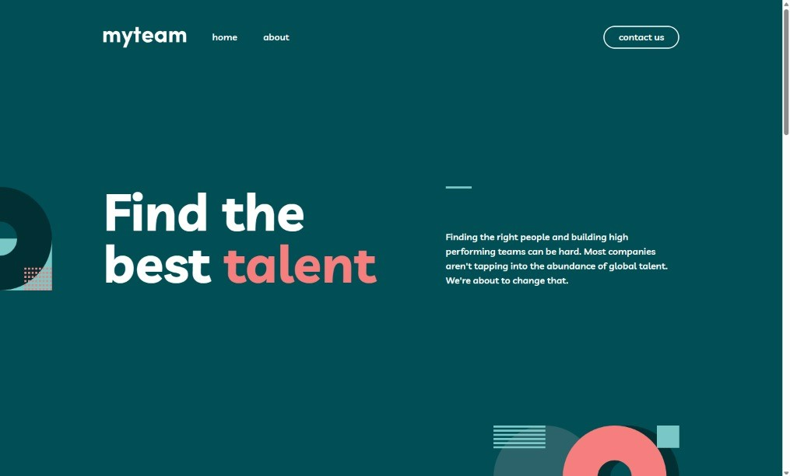

# Frontend Mentor - myteam website solution

This is a solution to the [myteam website challenge on Frontend Mentor](https://www.frontendmentor.io/challenges/myteam-multipage-website-mxlEauvW). Frontend Mentor challenges help you improve your coding skills by building realistic projects.

## Table of contents

- [Frontend Mentor - myteam website solution](#frontend-mentor---myteam-website-solution)
  - [Table of contents](#table-of-contents)
  - [Overview](#overview)
    - [The challenge](#the-challenge)
    - [Screenshot](#screenshot)
    - [Links](#links)
  - [My process](#my-process)
    - [Built with](#built-with)
    - [What I learned](#what-i-learned)
  - [Author](#author)

## Overview

### The challenge

Users should be able to:

- View the optimal layout for each page depending on their device's screen size
- See hover states for all interactive elements throughout the site
- See the correct content for each team member on the About page when the `+` icon is clicked
- Receive an error message when the contact form is submitted if:
  - The `Name`, `Email Address` or `Message` fields are empty should show "This field is required"
  - The `Email Address` is not formatted correctly should show "Please use a valid email address"

### Screenshot

### Links

- Solution URL: [Solution](https://www.frontendmentor.io/solutions/static-website-built-using-no-librariesframeworks-ecksEylhMo)
- Live Site URL: [Website](https://webguy83.github.io/myteam-website/)

## My process

### Built with

- Semantic HTML5 markup
- Flexbox
- CSS Grid

### What I learned

I developed this without frameworks or any libraries. Learned a bit of some cool tech with media queries although most of what I did to make this simple website I had done previously years ago. Was refreshing a bit to built this static way like the old days!

## Author

- Frontend Mentor - [@webguy83](https://www.frontendmentor.io/profile/webguy83)
- Instagram - [@canadianwebdev83](https://www.instagram.com/canadianwebdev83/)